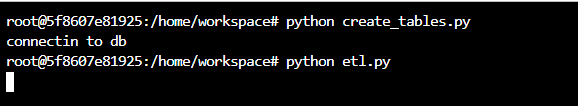
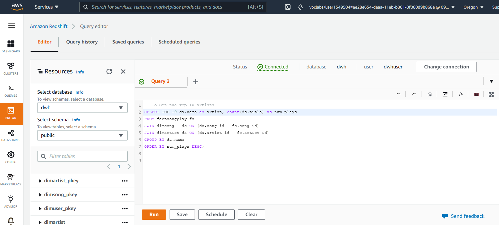
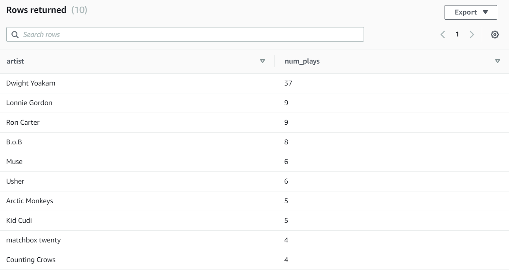
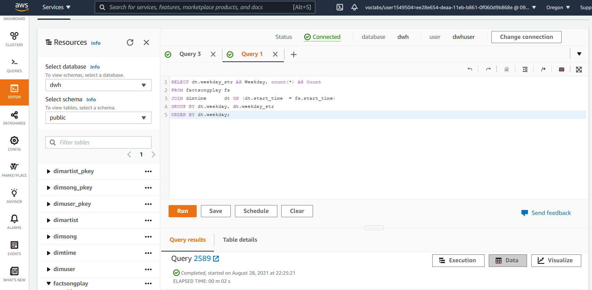
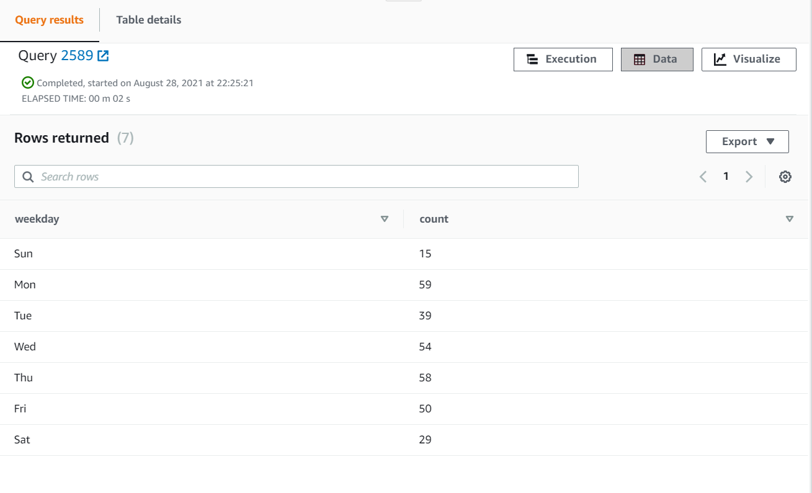

# Datawarehouse Project in the cloud

## Project Description
To create a datawarehouse in AWS and to build an ETL pipeline for the Sparkify database that has been hosted on Redshift.
Data is loaded from S3 to staging tables on Redshift and perform analytical queries on the warehouse.

## Project Datasets
Song Dataset and Log Datasets are available in S3 bucket

Song Dataset - `s3://udacity-dend/song_data`

Log Data - `s3://udacity-dend/log_data`

Both these datasets are in the jSON format.

Song Dataset - Is a subset of real data from the Million Song Dataset. Each file contains metadata about song and the artist for that song. 

Sample data from the song dataset

```
{"num_songs": 1, "artist_id": "ARJIE2Y1187B994AB7", "artist_latitude": null, "artist_longitude": null, "artist_location": "", "artist_name": "Line Renaud", "song_id": "SOUPIRU12A6D4FA1E1", "title": "Der Kleine Dompfaff", "duration": 152.92036, "year": 0}
```

Log Dataset - These are log files in JSON format generated by an event simulator based on the songs in the song dataset. 


## Database design
Creation of a star schema data warehouse that supports analytical workloads.

### Staging tables
There are 2 staging tables staging_events and staging_songs.
Staging tables are first loaded with the JSON data (events and song) using the COPY command provided by Amazon Redshift.
These tables are then used to extract , transform and load into a star schema of dimension and fact tables.

### Dimension Tables
1. DimUser - users in the app
    - user_id, first_name, last_name, gender, level
2. DimSong - songs in the music database
    - song_id, title, artist_id, year, duration
3. DimArtist - artists in the music database
    - artist_id, name, location, latitude, longitude
4. DimTime - timestamps of records in fact table broken down into specific units
    - start_time, hour, day, week, month, year, weekday, weekday_str
    
### Fact table
1. FactSongplay - records in the log data associated with song plays. i.e records with page `NextSong`
    - user_id, song_id, artist_id, session_id, start_time
    

### ETL Process
The staging tables are first loaded using the files stored in S3 using Amazon Redshift COPY command and then using Redshift INSERT command to load the dimension and fact tables.

### How to run the python code
1. Open the launcher and type python create_tables.py
    This will connect to the cluster defined in `dwh.cfg` file and creates all the tables above.
2. Next type python etl.py. This will then load all of the above tables in order.   
    
    


### Performing Analysis on the tables loaded.
#### Get Top 10 Artists





#### Popularity of the app by weekday




### Summary
This project demonstrates how we can build a simple data pipeline on AWS to support analytical queries.